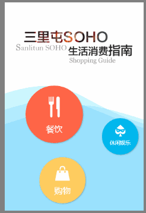
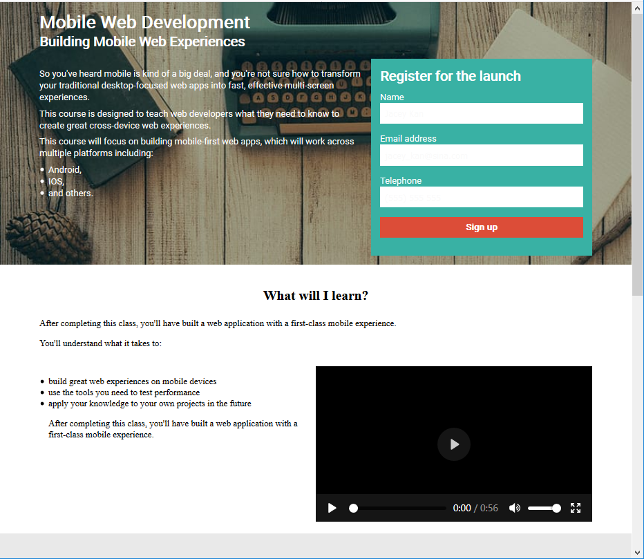

# MaterialLibrary
这是我的素材库，我计划把收集到的各种前端素材放在这里。

<!-- [在线演示](https://jaceykan.github.io/MaterialLibrary)
 -->

### 目录
* JS
	* 表格排序案例——[在线预览](表格排序案例.html)——[源码](表格排序案例.html)
	* 表单验证——[在线预览](表单验证.html)——[源码](表单验证.html)
	* 精品展示——[在线预览](精品展示/精品展示.html)——[源码](精品展示)
* 游戏
	* 贪吃蛇——[在线预览](贪吃蛇/贪吃蛇.html)——[源码](贪吃蛇)   
	

* 背景
	* canvas制作波浪状动态背景——[在线预览](Wave-likeDynamicBackground/Wave-likeDynamicBackground-html.html)——[源码](Wave-likeDynamicBackground)   
	
* 页面布局
	* pagePiling.js插件——[在线预览](https://alvarotrigo.com/pagePiling/)——[源码](https://github.com/alvarotrigo/pagePiling.js)   
	
* 响应式网站设计——[在线预览](ResponsiveWebDesign/ResponsiveWebDesign.html)——[源码](ResponsiveWebDesign)   
	

* CSS实现水平垂直居中的1010种方式——[在线预览](MaterialLibrary/CSS%E5%AE%9E%E7%8E%B0%E6%B0%B4%E5%B9%B3%E5%9E%82%E7%9B%B4%E5%B1%85%E4%B8%AD%E7%9A%841010%E7%A7%8D%E6%96%B9%E5%BC%8F/20181018test.html)——[源码](CSS实现水平垂直居中的1010种方式)

* CSS动画
	* CSS-animation-penguin——[在线预览](CSS-animation/penguin/CSSAnimationPenguin.html)——[源码](CCSS-animation/penguin)  
	
	* CSS-animation-Beating Heart——[在线预览](CSS-animation/BeatingHeart/beatingHeart.html)——[源码](CSS-animation/BeatingHeart)  
	

### 很棒的素材网站
 * [dowebok](http://www.dowebok.com/)

### 关于分享
如果你有有趣的素材想要分享给我，真是开心之至。  
请联系我吧: [jacey_kan@sina.com](mailto:jacey_kan@sina.com)

### 协议
本素材库遵循MIT协议，你可以不用经过我的许可直接使用。

MIT License

Copyright (c) 2018 

Permission is hereby granted, free of charge, to any person obtaining a copy
of this software and associated documentation files (the "Software"), to deal
in the Software without restriction, including without limitation the rights
to use, copy, modify, merge, publish, distribute, sublicense, and/or sell
copies of the Software, and to permit persons to whom the Software is
furnished to do so, subject to the following conditions:

The above copyright notice and this permission notice shall be included in all
copies or substantial portions of the Software.

THE SOFTWARE IS PROVIDED "AS IS", WITHOUT WARRANTY OF ANY KIND, EXPRESS OR
IMPLIED, INCLUDING BUT NOT LIMITED TO THE WARRANTIES OF MERCHANTABILITY,
FITNESS FOR A PARTICULAR PURPOSE AND NONINFRINGEMENT. IN NO EVENT SHALL THE
AUTHORS OR COPYRIGHT HOLDERS BE LIABLE FOR ANY CLAIM, DAMAGES OR OTHER
LIABILITY, WHETHER IN AN ACTION OF CONTRACT, TORT OR OTHERWISE, ARISING FROM,
OUT OF OR IN CONNECTION WITH THE SOFTWARE OR THE USE OR OTHER DEALINGS IN THE
SOFTWARE.
